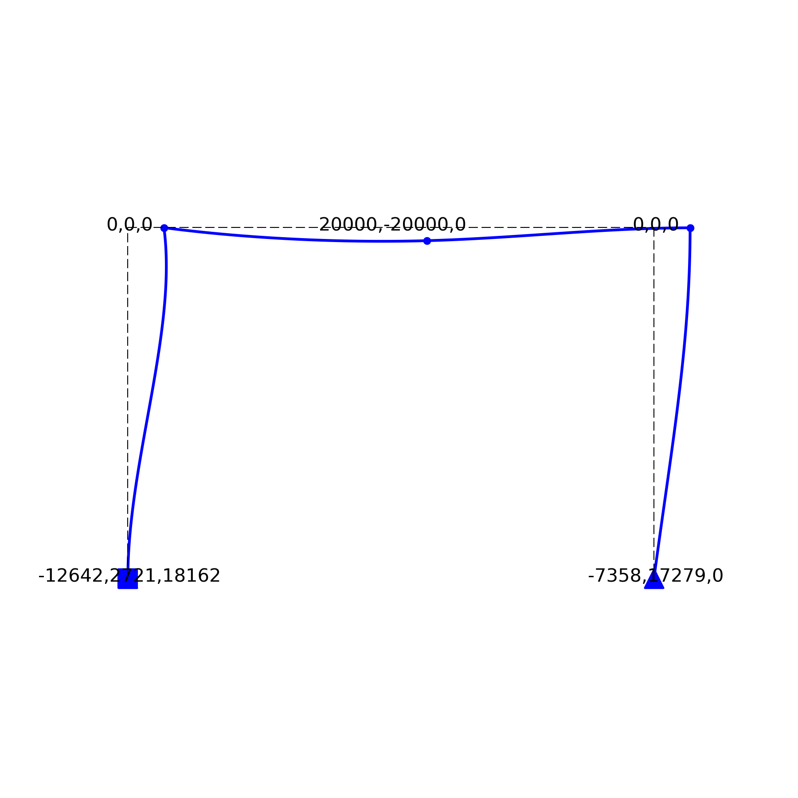

# staticFEM

Stiffness Matrix Analysis for 2D and 3D Euler-Bernoulli Frame Structures. 

<div align="center">
    
</div>

```python
import numpy as np 
from staticFEM.FEM import Truss 

nodes = np.array([[15, 10], [15, 0], [0, 10], [0, 0]]) 
elements = np.array([[2, 0], [3, 0], [0, 1], [2, 1], [3, 1], [2, 3]]) 
truss = Truss(nodes, elements, E=200e9, A=1.65e-3)
truss.add_loads(loads=[[0, -500e3],], nodes=[0,])
truss.add_constraints(dofs=[[1, 1], [1, 0]], nodes=[2, 3])
truss.initialise()  
truss.solve()
truss.show()
```

<div align="center">
    
</div>

```python
import numpy as np 
from staticFEM.FEM import Frame 

nodes = np.array([[0, 0], [0, 2], [1.5, 2], [3, 2], [3, 0]]) 
elements = np.array([[0, 1], [1, 2], [2, 3], [3, 4]]) 
frame = Frame(nodes, elements, E=200e9, A=1.65e-3, I=4.73e-6)
frame.add_loads(loads=[[20e3, -20e3, 0], ], nodes=[2, ]) 
frame.add_constraints(dofs=[[1, 1, 1], [1, 1, 0]], nodes=[0, 4])
frame.initialise()   
frame.solve()
frame.show()
```

<!-- <div align="center">
    
</div> -->