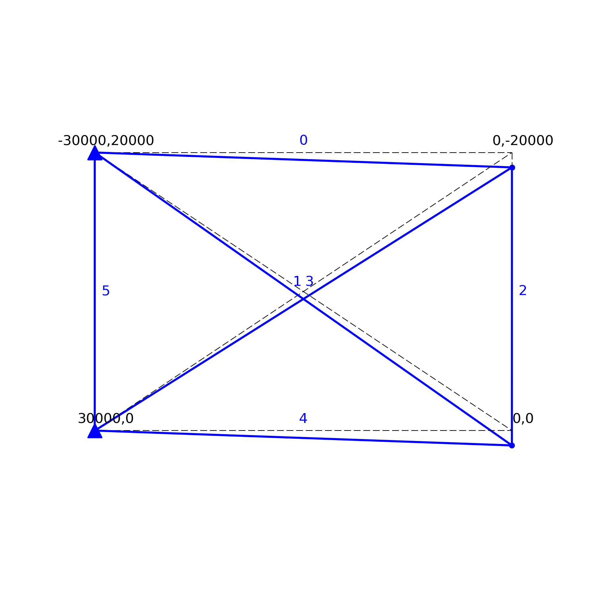

# staticFEM

Stiffness Matrix Analysis for 2d Trusses, Beams and Frames. 

<div style="text-align: center;">
    
</div>

```python
import numpy as np 
from staticFEM.FEM import Truss 

nodes = np.array([[15, 10], [15, 0], [0, 10], [0, 0]]) 
elements = np.array([[2, 0], [3, 0], [0, 1], [2, 1], [3, 1], [2, 3]]) 
truss = Truss(nodes, elements, E=200e9, A=0.2)
truss.add_loads(loads=[[0, -500e3],], nodes=[0,])
truss.add_constraints(dofs=[[1, 1], [1, 0]], nodes=[2, 3])
truss.initialise()  
truss.solve()
truss.show()